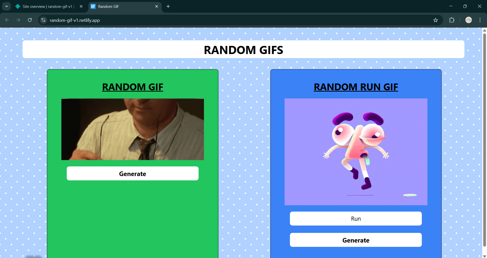

# 🎉 [Random GIF](https://random-gif-v1.netlify.app/) - React Application


**[Random GIF](https://random-gif-v1.netlify.app/)** is a fun and interactive **React-based** web application that generates random GIFs. Users can either load a random GIF automatically or search for a specific category of GIFs. This project leverages the **[Giphy API](https://developers.giphy.com/docs/api/)** to fetch and display dynamic GIF content, ensuring a delightful and entertaining user experience.

## 📑 Table of Contents

1. [🌟 Features](#-features)
2. [🔧 Tech Stack](#-tech-stack)
3. [📸 Preview](#-preview)
4. [📂 Project Structure](#-project-structure)
5. [🧑‍💻 Installation and Setup](#️-installation-and-setup)
6. [🌐 Deployment](#-deployment)
7. [📋 API Usage](#-api-usage)
8. [🤝 Contributing](#-contributing)
9. [📜 License](#-license)
10. [📬 Contact](#-contact)

## 🚀 Features

- 🎲 **Random GIF Generation:** Automatically displays a new random GIF on load.
- 🔍 **Search by Keyword:** Users can search for GIFs using their preferred keywords.
- 🔄 **Refresh GIF:** Click the "Generate" button to fetch a new GIF instantly.
- 📱 **Responsive Design:** Optimized for desktop and mobile devices.
- ⚡ **Fast & Smooth Performance:** Built using React for a fast and seamless experience.

## 🛠️ Tech Stack

- **Frontend:** [React.js](https://react.dev/), [Tailwind CSS](https://v2.tailwindcss.com/docs)
- **API:** [Giphy API](https://developers.giphy.com/docs/api/) (for fetching GIFs)
- **Deployment:** GitHub and Netlify

## 📸 Preview

### Random GIF


## 📂 Project Structure

```
random-gif/
├── public/
│   ├── index.html
│   └── favicon.ico
├── src/
│   ├── components/
│   │     ├── Random.jsx
|   |     └── Tag.jsx
│   ├── App.js
│   └── index.js
├── .env
├── .gitignore
├── package.json
└── README.md
```

## 🧑‍💻 Installation and Setup

1. **Clone the Repository**

```bash
git clone https://github.com/your-username/random-gif.git
cd random-gif
```

2. **Install Dependencies**

```bash
npm install
```

3. **Create a .env File**

```bash
REACT_APP_GIPHY_API_KEY=your_api_key_here
```

4. **Run the Application**

```bash
npm start
```

The app will be live at: `http://localhost:3000`

## 🌐 Deployment

To deploy on **GitHub Pages**:

1. Install `gh-pages`:

```bash
npm install gh-pages --save-dev
```

2. Add these scripts to `package.json`:

```json
"predeploy": "npm run build",
"deploy": "gh-pages -d build"
```

3. Deploy your app:

```bash
npm run deploy
```

## 📋 API Usage

This project uses the **Giphy API**. Get your free API key from [Giphy Developers](https://developers.giphy.com/).

### Example API Call

```javascript
const fetchRandomGif = async () => {
  const response = await fetch(
    `https://api.giphy.com/v1/gifs/random?api_key=${process.env.REACT_APP_GIPHY_API_KEY}`
  );
  const { data } = await response.json();
  console.log(data);
};
```

## 🤝 Contributing

Contributions are welcome! Feel free to fork this repository and submit a pull request.

1. Fork the project.
2. Create a new branch (`feature/your-feature`).
3. Commit your changes.
4. Push to the branch.
5. Open a Pull Request.

## 📄 License

This project is licensed under the **MIT License**.

## 📬 Contact

For any queries or suggestions, feel free to reach out:  
- **GitHub**: [vijays376](https://github.com/vijays376)  
- **Email**: vijayschouhan376@gmail.com

---

💡 **Enjoy generating fun and exciting GIFs!**

